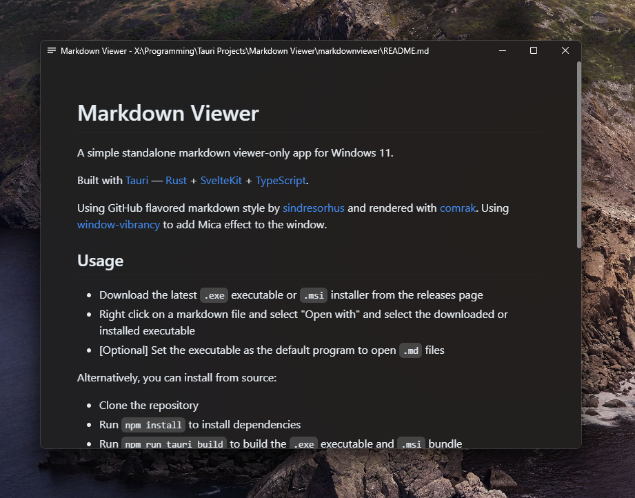
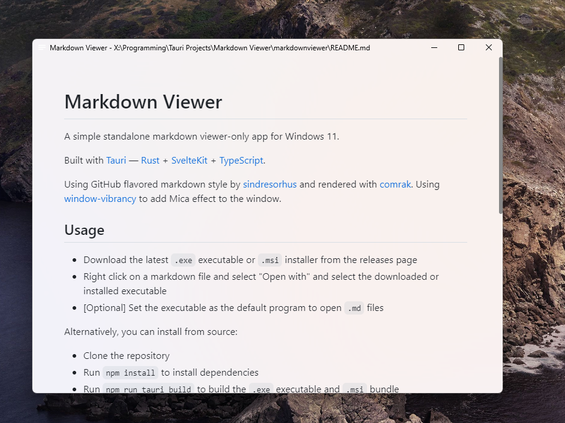

# Markdown Viewer

A simple standalone markdown viewer-only app for Windows 11.

Built with [Tauri](https://tauri.app/) — [Rust](https://www.rust-lang.org) + [SvelteKit](https://kit.svelte.dev/) + [TypeScript](https://www.typescriptlang.org/).

Using GitHub flavored markdown style by [sindresorhus](https://github.com/sindresorhus/generate-github-markdown-css) and rendered with [comrak](https://github.com/kivikakk/comrak). Using [window-vibrancy](https://github.com/tauri-apps/window-vibrancy) to add Mica effect to the window.

## Usage

- Download the latest `.exe` executable or `.msi` installer from the [releases page](https://github.com/alecames/MarkdownViewer/releases/latest)
- Right click on a markdown file and select "Open with" and select the downloaded or installed executable
- [Optional] Set the executable as the default program to open `.md` files

Alternatively, you can install from source:

- Clone the repository
- Run `npm install` to install dependencies
- Run `npm run tauri build` to build the `.exe` executable and `.msi` bundle
- Repeat the steps above to set the executable as the default program to open `.md` files

## Screenshots

## Known Issues

- Not tested in Windows 10 and earlier, meaning the window background may not look as intended
- Relative image embeds don't work
- YouTube/video embeds don't work

## Todo

- [ ] Fix relative image embeds
- [ ] Add option to toggle dark/light mode in app
- [ ] Add shortcut to edit in default text editor
- [ ] Add option to toggle markdown rendering
- [ ] Add syntax highlighting for code blocks
- [ ] Add file association option for `.md` files in the Windows installer
- [ ] Tweak Windows installer to prevent desktop shortcut by default
